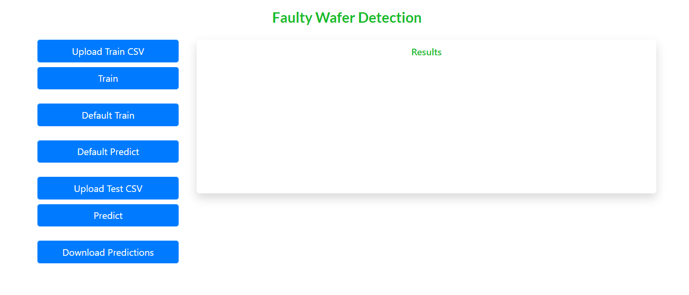
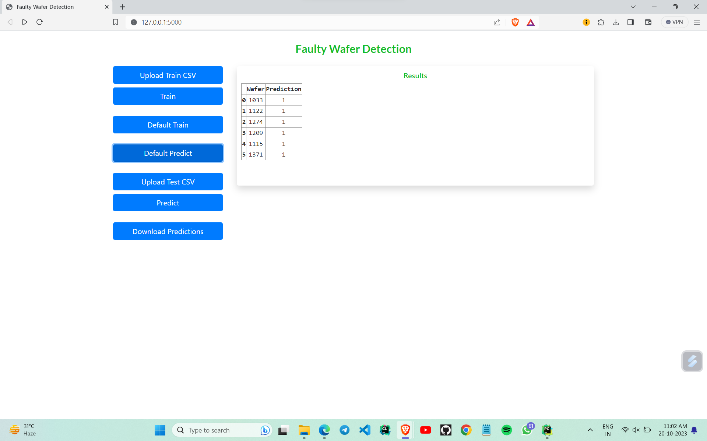

# Faulty Wafer Detection

Detect the faulty wafers using sensor data to get them replaced.

## Table of Contents

- [General Info](#general-information)
- [Data Description](#data-description)
- [Libraries](#libraries)
- [Screenshots](#screenshots)
- [Setup](#setup)
- [Usage](#usage)
- [Contact](#contact)
- [License](#license)

## General Information

In electronics, a [wafer](<https://en.wikipedia.org/wiki/Wafer_(electronics)>) (also called a slice or substrate) is a thin slice of semiconductor used for the fabrication of integrated circuits. The goal is to build a machine learning model which predicts whether a wafer needs to be replaced or not (i.e., whether it is working or not) based on the inputs from various sensors. There are two classes: +1 and -1.

- +1 means that the wafer is in a working condition and it doesn’t need to be replaced.
- -1 means that the wafer is faulty and it needs to be replaced.

## Data Description

[Data](https://www.kaggle.com/datasets/himanshunayal/waferdataset) is available as multiple sets of files. Each file will contain wafer names and 590 columns of different sensor values for each wafer and a column to indicate whether it is faulty [1] or not [-1]. Apart from data files, schema files are provided as a part of Data Sharing Agreement which contains all the relevant information about both [train](https://github.com/Anil-45/Faulty_wafer_detection/blob/main/src/data/train_schema.json) and [test](https://github.com/Anil-45/Faulty_wafer_detection/blob/main/src/data/test_schema.json) data such as:

- File name convention
- No of columns in each file
- Data type of each column
- Name of the columns

## Libraries

- Application Framework - flask, wsgiref
- Database operations - sqlite3
- Data processing and ML - numpy, pandas, matplotlib, sklearn, xgboost, kneed, pickle
- General operations - os, shutil, csv, json, re, datetime, time

## Screenshots



## Setup

Clone this repo using

```sh
git clone https://github.com/rohitsalla/Wafer-Fault-Detection.git
```

Install the required modules using

```sh
pip install -r requirements.txt
```

You can download data from [here](https://www.kaggle.com/datasets/himanshunayal/waferdataset) and place in _`data/raw/train`_ and _`data/raw/test`_

## Usage

Run the following command to start the application

```bash
python app.py
```

Open the [application](http://127.0.0.1:5000/)

- `Upload Train CSV` use this option to upload custom training files
- `Train` trains the model the using uploaded training files
- `Default Train` trains the model using default files. Make sure the data files are present in _`data/raw/train`_ to train the model. Trained models are saved to _`models`_ folder
- `Default Predict` predicts the output using saved models. Make sure the data files are present in _`data/raw/test`_ for prediction
- `Upload Test CSV` use this option to upload custom test files
- `Predict` predicts the outcome of custom files using saved models

You can find the logs in _`logs`_ folder

## Contact

Created By [@ramyamanasa](https://github.com/ramyamanasa)
and [@rohitsalla](https://github.com/rohitsalla)

##

Thank you.
